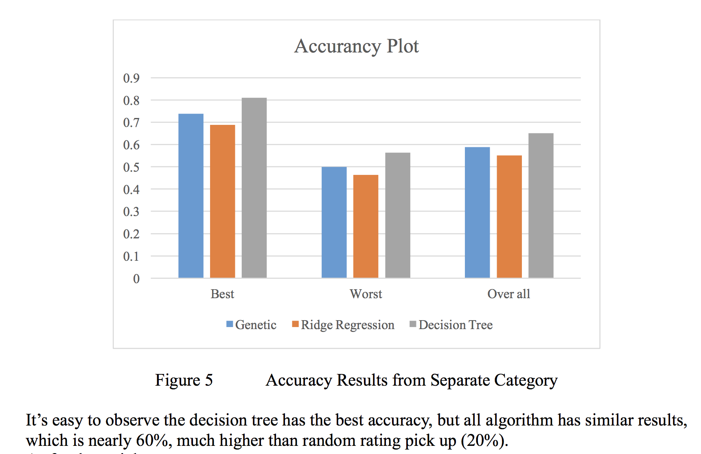

# Amazon Rating Prediction
This is a Java/Scala project running on Apache Spark used [dataset](http://jmcauley.ucsd.edu/data/amazon/) which contains product reviews and metadata from Amazon, including 142.8 million reviews spanning May 1996 - July 2014.
The total size of dataset we used is 60GB included detailed review texts.

The machine learning algorithm used in this project includes Ridge Regression, Decision Tree from **Spark.mllib** and a self-write genetic algorithm.

[ResultReport](doc/AmazonRatingPrediction.pdf)
## Deployment
* First follow the [instruction](https://spark.apache.org/downloads.html) from Apache Spark to install Spark on one or more server with JDK version 1.8
* Open project via pom.xml in IDE such like Eclipse and wait it to set up Spark on local machine
* Using command *ant* to compile and build project
* Run project on server or locally by changing configure file of Spark.

## Built With
* [Amazon Rating DataSet](http://jmcauley.ucsd.edu/data/amazon/) - JSON formate dataset used in this project
* [Apache Spark](https://spark.apache.org/) - The memory based distributed computation platform
* [HDFS](https://hadoop.apache.org/docs/r1.2.1/hdfs_design.html) - Distributed file system
* [Spark.Mllib](https://spark.apache.org/mllib/) - Machine learning lib used to analysis data

## Authors

* **Ang Li** - *Ridge Regression, Decesion Tree, Data Clean* - [Ang Li](https://github.com/leonmz)
* **Cheng Wang** - *Genetic Algorithm Developing, Processing JSON* - [Cheng Wang](https://github.com/gongfunaicha)
